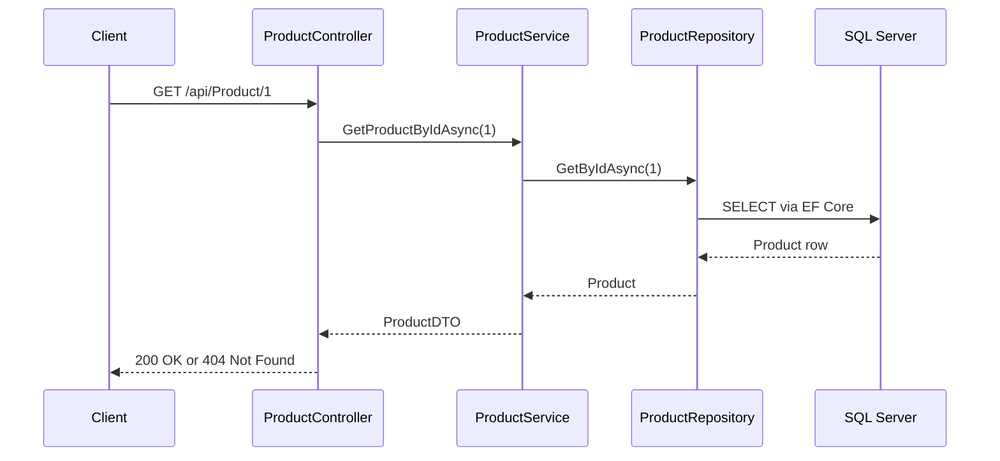

# Product Management API — Clean Architecture in ASP.NET Core (.NET 10)

A RESTful Web API for managing products, built to demonstrate **Clean Architecture** with **ASP.NET Core**, **Entity Framework Core** and **SQL Server**.

## Tech Stack

- ASP.NET Core Web API (.NET 10)
- Entity Framework Core 10 (Code First, SQL Server / LocalDB)
- Repository pattern and Service layer
- DTOs to keep entities out of the API surface
- Swagger UI (Swashbuckle)

## Architecture

The solution is organised into layers inside a single project. Dependencies point inward: controllers depend on services, services depend on repository interfaces, and the domain depends on nothing.

## System architecture


## Folder structure
```
ProductManagement/
├── Domain/
│   └── Entities/                 # Product entity and business rules
├── Application/
│   ├── DTOs/                     # ProductDTO, CreateProductDTO, UpdateProductDTO
│   ├── Interfaces/
│   │   ├── Repositories/         # IProductRepository
│   │   └── Services/             # IProductService
│   └── ProductService/           # Business logic / use cases
├── Infrastructure/
│   ├── Data/                     # ApplicationDbContext (EF Core)
│   └── Repositories/             # ProductRepository
├── InterfaceAdapters/
│   └── Controllers/              # ProductController (HTTP layer)
├── Migrations/                   # EF Core migrations
└── Program.cs                    # Dependency injection and middleware setup
```

## API Endpoints

| Method | Route | Description |
|--------|-------|-------------|
| GET | `/api/Product` | Get all products |
| GET | `/api/Product/{id}` | Get a product by id |
| POST | `/api/Product` | Create a product |
| PUT | `/api/Product/{id}` | Update a product |
| DELETE | `/api/Product/{id}` | Delete a product |

## Request flow (GET /api/Product/1)

## Getting Started

### Prerequisites

- [.NET 10 SDK](https://dotnet.microsoft.com/download)
- SQL Server LocalDB (installed with Visual Studio) or any SQL Server instance

### Run locally

1. Clone the repository
   ```bash
   git clone https://github.com/Milind300/CleanArchitecture-ProductManagement-API.git
   cd CleanArchitecture-ProductManagement-API/ProductManagement
   ```
2. Check the connection string in `appsettings.json` (defaults to LocalDB)
   ```json
   "DefaultConnection": "Server=(localdb)\\MSSQLLocalDB;Database=ProductDB;Trusted_Connection=True;TrustServerCertificate=True;"
   ```
3. Create the database
   ```bash
   dotnet tool install --global dotnet-ef
   dotnet ef database update
   ```
4. Run the API
   ```bash
   dotnet run
   ```
5. Open Swagger at `https://localhost:<port>/swagger`

## Screenshots


## Roadmap

- [ ] Global exception handling middleware
- [ ] Return `201 Created` from POST
- [ ] FluentValidation for DTOs
- [ ] Unit tests (xUnit + Moq)
- [ ] Pagination and filtering
- [ ] GitHub Actions CI build

## License

MIT
